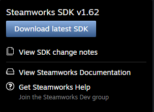
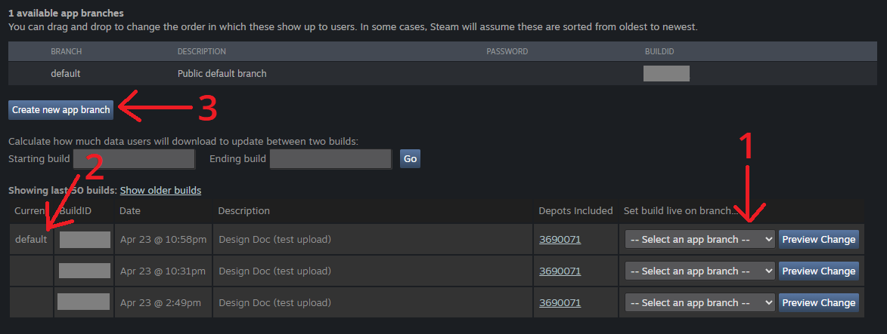
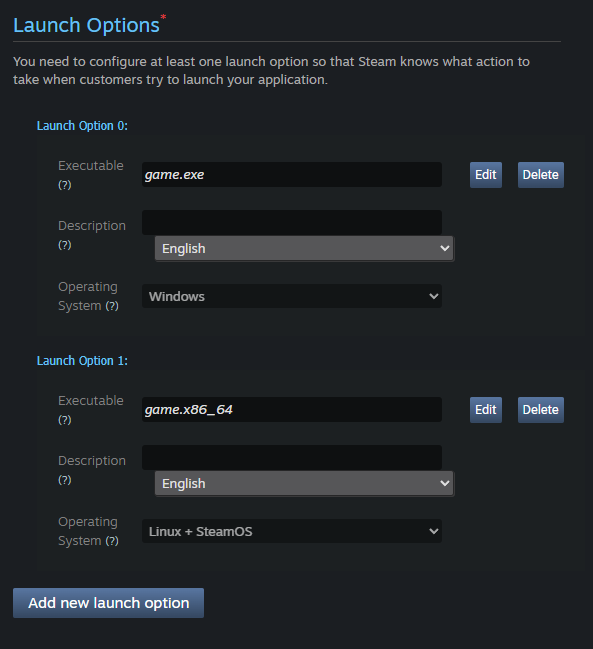

# SteamRoller

A data-driven build and release checklist for the Godot 4 editor. Define your
workflow as an ordered list of steps in a `.tres` config file; the plugin
renders it as a dockable checklist with per-step consoles and dependency
gating between steps.

Windows-only for now.

## How a step looks

Each step is one `SteamRollerStep` resource with an `action` enum that
determines its behavior. The available actions:

| Action | Behavior |
|---|---|
| `CHECKBOX` | Manual no-op. User ticks it when done. |
| `NEW_TAB` | Divider. Steps after it appear in a new tab named `tab_name`. |
| `INPUT` | LineEdit bound to a project setting. The field is the completion state. |
| `RUN_GDUNIT` | Run all GdUnit4 tests. Disabled if GdUnit isn't installed. |
| `RECORD_MOVIE` | Movie maker + main scene + optional ffmpeg re-encode. |
| `DELETE_FOLDER` | Recursively delete `params.path`. Optionally recreate folders via `params.paths`. |
| `CREATE_FOLDERS` | Create each path in `params.paths`. |
| `ARCHIVE_FOLDER` | Copy `params.source` → `params.destination`. |
| `CLEAR_USER_DATA` | Delete `user://`. |
| `OPEN_IN_EXPLORER` | Reveal `params.path` in the OS file manager. |
| `COPY_TO_CLIPBOARD` | Copy `params.text` to the clipboard. |
| `RESET_AND_INCREMENT` | Reset current tab + bump last numeric segment of version. |
| `RUN_COMMAND` | External process using `executable`, `args`, `working_dir`. |

In the panel, each step renders as:

```
[✓] Step name
    Optional BBCode description goes here.
              [ Action button ]
    ▶ Console (0)
─────────────────────────────────────────
```

`INPUT` steps swap the checkbox header for `Label + LineEdit`. Actions with
no button (CHECKBOX, NEW_TAB, INPUT) just show the header and description.

## Installation

1. Copy this folder into your project at `res://addons/steamroller/`.
2. Enable in **Project → Project Settings → Plugins**.
3. Copy `addons/steamroller/templates/default_config.tres` somewhere outside
   the addon (e.g. `res://steamroller_config.tres`).
4. In **Project Settings → General**, set
   `application/steamroller/config_path` to your copy.
5. The dock appears bottom-right. Open the **Start Guide** tab for a full
   walkthrough with screenshots (same content as below).

## SteamPipe (steamcmd)

Steam uploads use Valve's SteamPipe ContentBuilder, which can't be bundled
due to Steamworks SDK licensing.

1. Download the Steamworks SDK from <https://partner.steamgames.com/>.

   

2. Extract it adjacent to your project. The default config expects
   `${PROJECT_DIR}../steamworks_sdk/`; override via the `STEAM_CMD_PATH`
   and `VDF_DIR` variables.
3. Place your app's `.vdf` at
   `steamworks_sdk/tools/ContentBuilder/scripts/app_<APP_ID>.vdf`.
4. Run `steamcmd.exe` once manually to cache login credentials.

The default config ships with `STEAM_APP_ID = 480` (Valve's public SpaceWar
test app) so you can dry-run without a real product on Steam.

## First push to Steam

After your first upload, SteamPipe may report a failure because the `beta`
branch does not exist yet. Set one build to the default branch, then create
the `beta` branch from the Steamworks dashboard:



Before players can install the game, add launch options for Windows and Linux
under **Installation → General Installation** (names should match your depot
output, e.g. `builds/latest/game_depot`):



## Itch (butler)

`butler.exe` ships bundled at `addons/steamroller/butler-windows-amd64/`.
Run `butler login` once from a terminal, then uploads work.

## Variables

User-defined variables live in `config.variables`. Built-ins always available:

- `${VERSION}` — `application/config/version`
- `${APP_NAME}` — `application/config/name`
- `${COMMIT_MESSAGE}` — `application/config/commit_message`
- `${DEMO_MODE}` — `"true"` or `"false"`
- `${USER_DIR}` — globalized `user://`
- `${PROJECT_DIR}` — globalized `res://` (trailing slash included)
- `${PLATFORM}` — `OS.get_name()`

Undefined variables emit a warning and remain as literal `${TOKEN}` in the
rendered command, so misconfigurations show up immediately in the console.

## Version increment

`RESET_AND_INCREMENT` finds the last numeric segment of
`application/config/version` and increments it by one. Works for any segment
count:

- `1.2.3.4` → `1.2.3.5`
- `0.1` → `0.2`
- `2.345` → `2.346`

Use whatever your platform needs (Windows resource versions want 4 segments,
others can use fewer).
